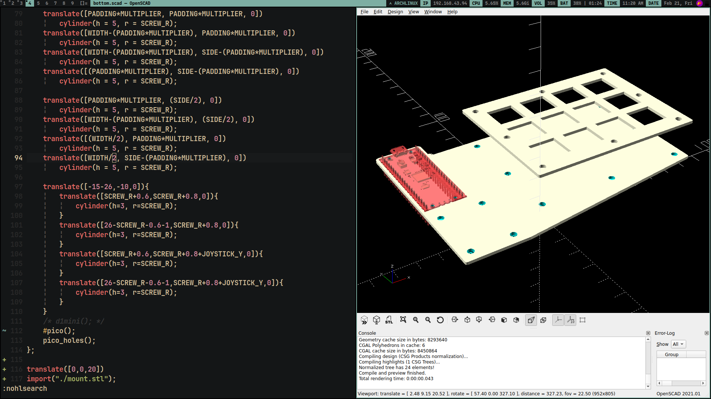
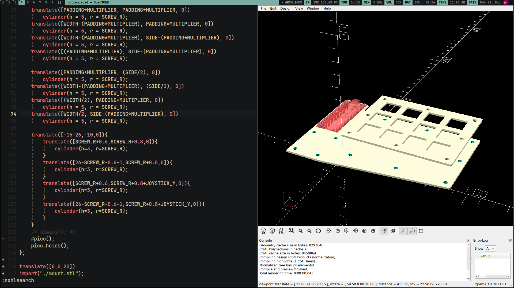

# One Handed Controller for playing games

- Currently targeting right handed controller and for Tekken because it needs lesser buttons than games like GTA V or CS GO

## Prototype 1

- All files are inside the `prototype_1/` directory

### Shortcomings

- Screw mounting holes are not in the correct place in the bottom plate
- The gap between adjacent switches is not large enough for the keycaps to fit in

### Learnings

- Metal standoffs are enough to hold the top plate rigidly without any visible bending

</img>
</img>
</img>
</img>
</img>

## Prototype 3

- Switched from a 3x3 switch matrix to a 4x3 switch matrix
- Added dedicated mounting holes for the microcontroller
- Corrected the positioning of the analog joystick and the gap between adjacent MX switches

### Order

- Switch Mount plate : Rs. 74 (PLA - black)
- Bottom Plate - Rs. 122 : PLA - black - 1.5mm - Rs. 149 : Mild Steel - 1mm - Rs. 167 : Mild Steel - 2mm - Rs. 112 : ABS black - 2mm - Rs. 122 : ABS black - 3mm (this is the one I will be ordering) - Rs. 104 : Transparent Acrylic - 2mm - Rs. 263 : Stainless Steel 304 - 1mm

> Note: I have switched the bottom plate a little bit so that a raspberry pi pico could be mounted on the bottom plate so, the price could be a bit skewed, just ~5/6rs

### Final BOM

- Bottom plate -> ABS (non metal laser cut) 3mm -> Rs. 129 + taxes = Rs. 178 (ordered)
- Mount plate -> ABS (PLA 3d printed) -> Rs. 79 + taxes (ordered alongside the single case for -> https://github.com/aditya23043/split36)

### 2025-02-26 23:48

- Finally, all the materials have arrived (I was waiting for the case only. I already had all of the other stuff in my inventory)
- Furthermore, I have assembled all the materials as well

- Since my two of my mid semester exams are still remaining (PSD and F&W), I will be waiting for them to get over before beginning with the firmware
